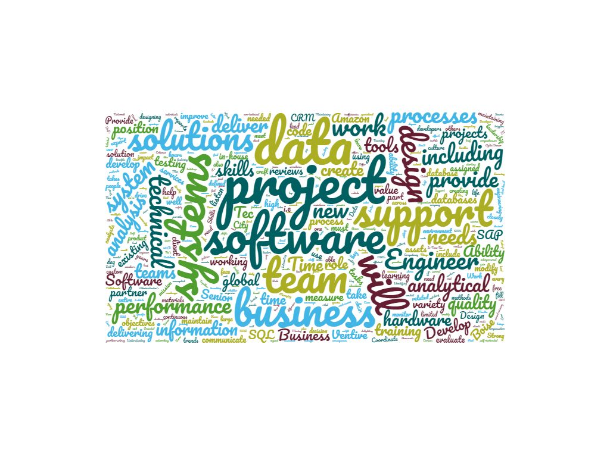

# Hi

My name is Christopher Mitchell. I'm a beginning developer, learning to code at Codeworks, in Boise, ID. My background is mostly in restaurant ownership, property management and business consultation, but I also really enjoy indie tabletop roleplaying games and have many ideas for incorporating my love for technology and my love for story-telling games into areas that are currently underserved. Also, while I like talking about ideas, I'm wildly uncomfortable talking about myself. If you have reached the end of this paragraph, I'm sure that's very apparent.

**Currently reading:** Clean Code  
**Currently playing:** Burning Wheel

